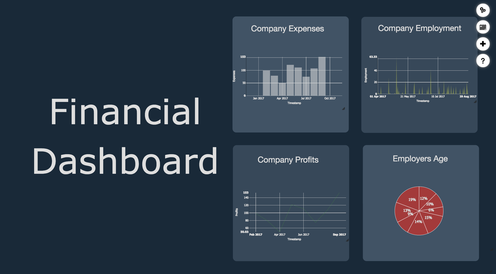

# Follow My Steps

Welcome to Follow My Steps Web and Mobile project

Follow My Steps is a system, developed for both web and mobile, to study the best way to present visualizations to users, regarding their past experiences based on lifelogging data collected over an extended period of time, in a personally relevant way.
It offers a personalized interface, with 9 different visualizations techniques, built to help users with their forgotten memories or experiences.

This system is divided into two parts, the Project which is the web-based application and the App which is the mobile application.

## Web
The Web Application is focused on displaying the user's data through the use of visualization techniques that can be inserted, edited or deleted, by each user, on the interface.
Initially the system support around 7 types of file formats, which include the CSV, LIFE, XLSX, GPX, JPG, PNG and GIF. You can extend these functionalities by creating new plugins. Furthermore, you can create new visualizations besides the ones implemented, which include the <strong>Map</strong>, <strong>the Bar Chart</strong>, the <strong>Area chart</strong>, the <strong>Line Chart</strong>, the <strong>Pie Chart</strong>, <strong>Calendar Heatmap</strong>, the <strong>Timeline</strong>, the <strong>Text</strong> and the <strong>images</strong>.

To run the web application you need to posteriorly install the PostgreSQL database and its geographical extension PostGIS.
Additionally, you need to have Node.js installed on your machine.

PostgreSQL: https://www.postgresql.org/download/
 PostGIS: https://postgis.net/source/
 Node.js: https://nodejs.org/en/download/

## Mobile
To use the mobile application you need to have the web application running. 
